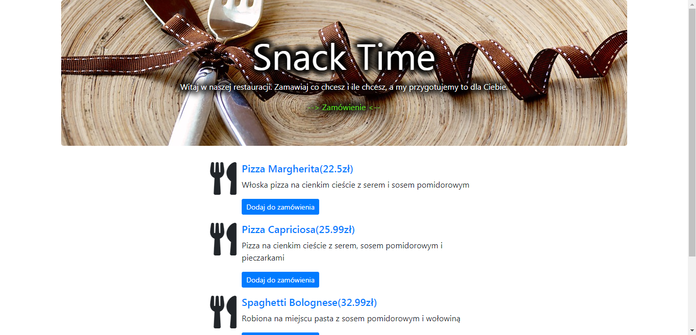
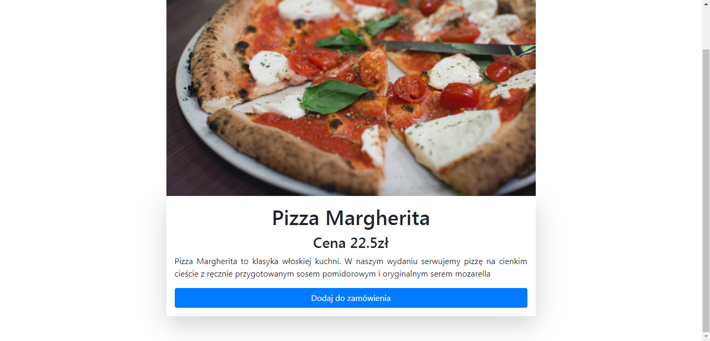
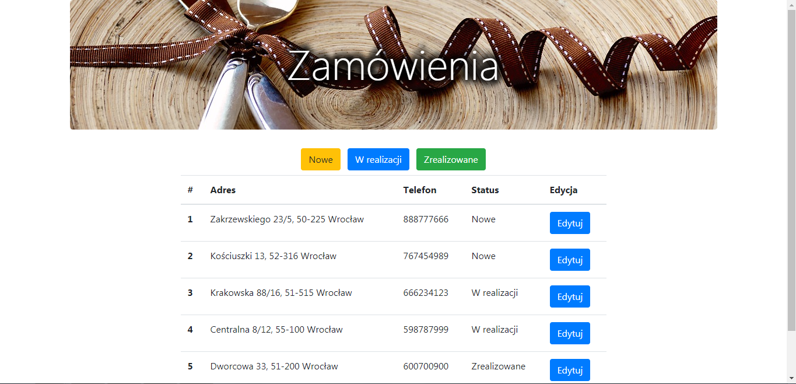
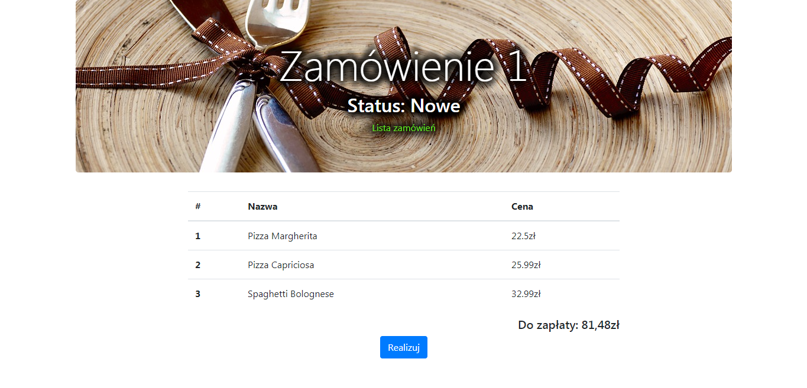

# SnackTimeApp

"SnackTimeApp" is a web app for ordering food. (stripped down of some optional parts)

### Run

Main page:
Application deployed on Heroku by this [link](https://snack--time.herokuapp.com/)

Mapping to "/panel/zamowienia" displays the section intended for employees.
 - [link](https://snack--time.herokuapp.com/panel/zamowienia)

  
  
  

### Tech

* [Java] - v12
* [Spring Boot] - v2.2.1
* [Spring Data JPA]
* [Spring MVC]
* [Thymeleaf]
* [Maven] - v3.6.3

### Todos

 - Write Tests

   [Java]: <https://www.java.com>
   [Spring Boot]: <https://spring.io/projects/spring-boot>
   [Spring Data JPA]: <https://spring.io/projects/spring-data-jpa>
   [Spring MVC]: <https://docs.spring.io/spring/docs/current/spring-framework-reference/web.html>
   [Thymeleaf]: <https://www.thymeleaf.org/>
   [Maven]: <https://maven.apache.org/>
